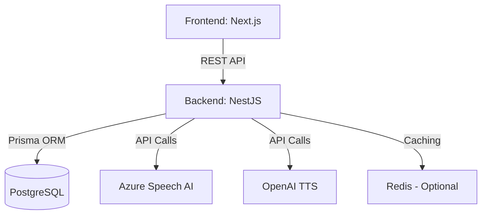

# Agen-English: AI-Powered Language Learning Platform

Agen-English is a state-of-the-art language learning system designed with the **Green-Tick Design Standard**. It features Spaced Repetition (SM-2), Speech AI for pronunciation scoring, and a gamified experience with XP and Leaderboards.

## 🚀 Features

- **Spaced Repetition (SM-2)**: Optimized vocabulary review cycles.
- **Speech AI Scoring**: Accurate pronunciation and fluency assessment using Levenshtein distance.
- **Phoneme-level Feedback**: Deep analysis of speech patterns (Azure Speech integration).
- **Gamification**: XP system, levels, streaks, and global leaderboards.
- **Multimedia Lessons**: High-fidelity video and audio player for immersive learning.
- **RBAC**: Secure role-based access control with Super Admin privileges.

## 🛠 Tech Stack

- **Frontend**: Next.js 14, CSS Modules, Lucide Icons.
- **Backend**: NestJS, Prisma ORM, JWT Authentication.
- **Database**: PostgreSQL.
- **DevOps**: Docker, Docker Compose.

## 🏗 Architecture



## ⚙️ Setup Guide

### Prerequisites
- Node.js v20+
- Docker & Docker Compose

### 1. Clone & Environment
```bash
git clone https://github.com/phuc2184/Agen-English.git
cd Agen-English
```
Create a `.env` file in the `backend` directory based on the provided configuration.

### 2. Launch with Docker
```bash
docker-compose up --build -d
```

### 3. Database Sync
```bash
cd backend
npx prisma migrate dev
npx prisma db seed
```

## 🛡 Security & Admin
- **Default Admin**: `dangphuc99`
- **Role**: `SUPER_ADMIN`
- **Features**: Unlimited AI access, Gold Badge visuals, Detailed Speech Debugging.

## 📝 License
MIT License. Created by dangphuc99.
